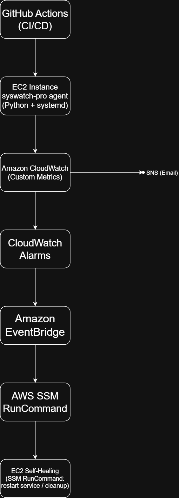

# syswatch-pro 🚀
Production-style EC2 monitoring & self-healing agent built with
Python, CloudWatch, SNS, SSM, EventBridge, and GitHub Actions.

---

## 📌 Problem Statement
EC2 instances often fail silently due to high CPU, memory leaks,
or disk exhaustion. Manual monitoring and recovery does not scale.

---

## 💡 Solution
syswatch-pro is a lightweight monitoring agent that:
- Collects system metrics
- Pushes them to CloudWatch
- Triggers alerts
- Automatically repairs the instance without human intervention

---

## 🏗️ Architecture Overview


---

## 🔁 Data Flow
1. Python agent collects CPU, Memory, Disk
2. Metrics sent to CloudWatch (custom namespace)
3. CloudWatch Alarms monitor thresholds
4. SNS sends notifications
5. EventBridge detects ALARM state
6. SSM RunCommand executes auto-fix
7. EC2 self-heals and service restarts

---

## ⚙️ Features
- Python monitoring agent (psutil)
- CloudWatch custom metrics
- CloudWatch dashboard
- SNS alerts (Email/SMS)
- Self-healing via SSM Run Command
- Event-driven automation (EventBridge)
- CI/CD deployment using GitHub Actions (SSM-based)
- systemd-managed Linux service

---

## 🧪 What Happens During Failure
| Condition | Action |
|---------|-------|
| CPU > 85% | Auto-fix triggered |
| Memory > 80% | Clear cache + restart |
| Disk > 90% | Logs cleaned |

---

## 🛠️ Installation (1 Command)
```bash
./scripts/install.sh


